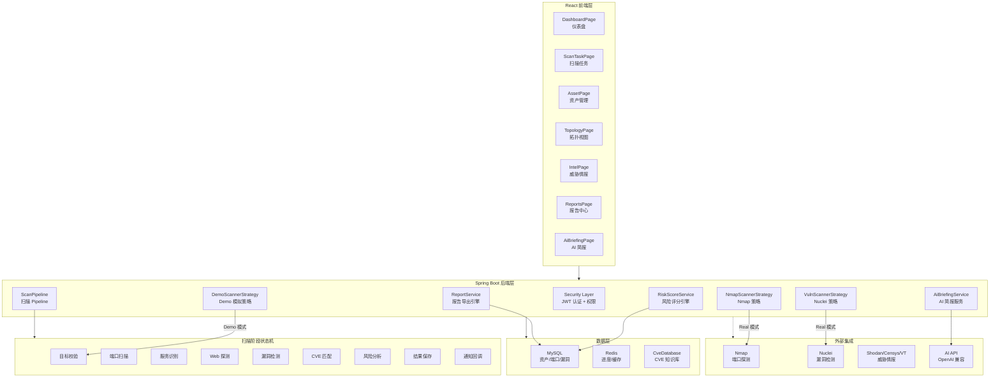
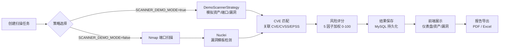

# ServerScout 服务器资产攻击面管理与风险分析平台

[](https://github.com/18307519324az/ServerScout/actions/workflows/ci.yml)

## 项目简介

ServerScout 是一个基于 Spring Boot 3 与 React 18 构建的服务器资产攻击面管理与风险分析平台，集成了 Nmap 端口探测与 Nuclei 漏洞检测，围绕资产发现、服务识别、漏洞扫描、风险评分、报告导出与 AI 风险简报生成等场景，将分散的安全扫描结果整合为可分析、可追踪、可展示的统一风险视图。

## 项目亮点

- **资产全生命周期管理**：从资产发现、端口探测到漏洞跟踪，形成完整的资产画像
- **扫描阶段状态机**：9 阶段 Pipeline 状态机，实时追踪扫描进度，阶段粒度细到目标校验、端口扫描、Web 探测、CVE 匹配、风险分析
- **风险评分模型**：5 因子加权评分（暴露面、漏洞严重性、服务风险、可利用性、业务重要性）+ 修复扣减，0-100 分量化风险
- **Demo Mode**：演示模式内置模拟数据，不依赖真实 Nmap/Nuclei，开机即用，适合展示与教学
- **报告导出**：PDF / Excel 双格式，支持中文，含概览、资产、端口、漏洞、阶段、风险评分与修复建议 7 个维度
- **AI 风险简报**：将技术扫描结果转换为更易阅读的结构化风险摘要，支持 LLM 与本地分析双模式
- **威胁情报集成**：支持 Shodan、Censys、VirusTotal、NVD、OTX 等外部情报源查询
- **Docker 一键部署**：`docker-compose up -d --build` 即可启动完整环境

## 技术栈

| 层级 | 技术 |
| --- | --- |
| 前端 | React 18、TypeScript、Vite、Tailwind CSS、Ant Design、ECharts、G6、D3.js |
| 后端 | Java 17、Spring Boot 3.3.5、Spring Security 6、JWT、JPA / Hibernate |
| 数据库 | MySQL 8.0、Redis |
| 扫描工具 | Nmap、Nuclei |
| 报告导出 | iText 7（PDF）、Apache POI（Excel） |
| AI 能力 | OpenAI 兼容接口、本地规则分析兜底 |
| 部署 | Docker、Docker Compose、Shell |

## 系统架构



## 扫描流程



扫描流程的核心是策略模式：`ScannerStrategy` 接口定义 `supports()` 和 `execute()`，`DemoScannerStrategy` 与 `NmapScannerStrategy` / `NucleiScannerStrategy` 各自实现逻辑，可插拔替换，不影响主流程。

## 核心功能

- **仪表盘**：资产概况、风险评分、端口分布、严重等级分布、30 天趋势、风险资产 Top 5、快速操作入口
- **资产管理**：资产列表与详情、端口/服务/Web 指纹/SSL 证书/蜜罐检测
- **扫描任务**：任务创建（QUICK / STEALTH / WEB / FULL / CUSTOM / NUCLEI）、实时进度追踪、阶段状态展示、Pipeline 日志
- **漏洞管理**：漏洞列表与详情、CVE 关联、CVSS/EPSS 评分、状态追踪（待处理/已确认/已修复/误报）
- **风险评分**：5 因子量化评分、可解释风险原因与修复建议、按任务/资产维度查询
- **攻击面拓扑**：资产关系可视化、攻击面地图、技术栈雷达图
- **威胁情报**：IP 情报、域名情报、CVE 查询、Censys、VirusTotal 集成
- **报告导出**：任务概览 PDF、多维 Excel 报告（7 Sheet）
- **AI 风险简报**：自由格式证据输入 → 结构化风险摘要

## 功能截图

> 以下截图在 Demo Mode 下截取，展示项目核心页面。点击图片可查看原图。

| 页面 | 截图 | 说明 |
| --- | --- | --- |
| 登录页 | `docs/images/login-page.png` | 登录界面，支持验证码与 RSA 加密 |
| 仪表盘 | `docs/images/dashboard.png` | 资产概况、风险评分、趋势图表 |
| 扫描任务详情 | `docs/images/scan-task-detail.png` | 阶段进度、Pipeline 日志、风险评分 |
| 扫描阶段状态 | `docs/images/scan-stages.png` | 9 阶段状态机进度展示 |
| 风险评分 | `docs/images/risk-score.png` | 5 因子评分、风险原因、修复建议 |
| 漏洞列表 | `docs/images/vulnerabilities.png` | 漏洞分级、CVE 展示、状态管理 |
| 报告中心 | `docs/images/reports.png` | 任务列表、PDF/Excel 下载 |
| 资产列表 | `docs/images/assets-list.png` | 资产清单、端口统计、标签 |
| 攻击面拓扑 | `docs/images/topology.png` | 资产关系可视化地图 |

## 快速启动

### 环境要求

- Java 17+、Maven 3.9+
- Node.js 18+
- MySQL 8.0+
- 可选：Redis、Nmap、Nuclei

### 数据库初始化

```bash
mysql -u root -p < serverscout-init.sql
```

### 启动后端

```bash
cd backend
mvn spring-boot:run -Dspring-boot.run.profiles=dev
```

API 地址：`http://localhost:8080`

### 启动前端

```bash
cd frontend
npm install
npm run dev
```

前端地址：`http://localhost:5173`

## Docker 一键部署

```bash
docker-compose up -d --build
```

启动后包含 MySQL 8.0、Redis、Spring Boot 后端和 React 前端四个服务，前端通过 Nginx 代理后端 API。

## 演示账号

| 账号 | 密码 | 角色 |
| --- | --- | --- |
| `admin` | `admin123` | 管理员 |
| `demo_user` | `demo123` | 普通用户 |

Demo Mode 开启时，系统使用模拟数据演示扫描流程，不会执行真实 Nmap / Nuclei。

## 运行模式与切换方式

ServerScout 支持两种运行模式：**Demo Mode** 和 **Real Mode**，通过环境变量 `SCANNER_DEMO_MODE` 控制，切换后需重启服务。

| 特性 | Demo Mode（默认） | Real Mode |
|------|-------------------|-----------|
| 扫描引擎 | 模拟数据生成器 | Nmap + Nuclei |
| 目标访问 | 不访问真实目标 | 扫描指定目标 |
| 数据来源 | 预置模拟数据 | 真实扫描结果 |
| Nmap 检测 | 不影响行为 | 必须可用 |
| 外部依赖 | 无需安装工具 | 需要 Nmap/Nuclei |
| 授权确认 | 可选 | 强制要求 |
| 适用场景 | 演示/教学/开发 | 真实安全评估 |

**切换方式：**

修改 `.env` 文件中的配置：

```env
# Demo Mode（默认）
SCANNER_DEMO_MODE=true
```

```env
# Real Mode（真实扫描）
SCANNER_DEMO_MODE=false
NMAP_PATH=nmap
NUCLEI_PATH=nuclei
```

切换后重启服务：

```bash
docker compose down
docker compose up -d --build
```

**注意：**
- Nmap / Nuclei 已检测到只代表工具可用性，实际是否执行真实扫描由 `SCANNER_DEMO_MODE` 决定
- Real Mode 下创建扫描任务必须确认目标已获得合法授权
- 单个扫描任务的 `scanMode` 记录创建时的运行模式，不随后续切换改变

## Demo Mode 说明

Demo Mode 是 ServerScout 内置的演示模式，通过 `SCANNER_DEMO_MODE=true` 环境变量开启（默认启用）。

- **不依赖真实工具**：无需安装 Nmap、Nuclei，无需真实扫描目标
- **模拟扫描流程**：生成真实感模拟数据 — 资产、端口、服务、漏洞、风险评分
- **阶段进度展示**：完整展示 9 阶段 Pipeline 状态机，包括进度百分比
- **风险评分验证**：Demo 扫描自动触发风险评分计算，Dashboard Top 5 和详情页直接展示
- **报告导出可用**：Demo 模式生成的数据也可用于 PDF / Excel 报告导出
- **关闭 DEMO 模式**：`SCANNER_DEMO_MODE=false` 后恢复真实 Nmap / Nuclei 扫描

## 扫描安全声明

本项目仅用于授权资产的安全检测、学习研究和毕业设计展示。使用 Nmap、Nuclei 等工具前，请确认目标资产归属明确并已获得授权。严禁将本项目用于未授权扫描、攻击、入侵或破坏第三方系统。

## 核心设计

### ScanPipeline / 阶段状态机

扫描任务分为 9 个阶段按序执行：目标校验 → 端口扫描 → 服务识别 → Web 探测 → 漏洞检测 → CVE 匹配 → 风险分析 → 结果保存 → 通知回调。每个阶段有 PENDING / RUNNING / SUCCESS / FAILED / SKIPPED 五种状态，前端实时追踪进度百分比。

### Demo Mode

当 `app.scan.demo-mode=true` 时，`DemoScannerStrategy` 接管扫描执行逻辑，按扫描类型（QUICK/FULL/NUCLEI 等）生成对应规模的模拟资产、端口与漏洞数据。Demo 模式下 IP 地址根据目标范围智能衍生，端口和服务从预置池中选取，漏洞数据引用 CveDatabase 已有 CVE ID。

### 风险评分模型

5 因子加权评分算法：

```
finalRiskScore =
assetExposureScore × 25%
+ vulnerabilitySeverityScore × 30%
+ serviceRiskScore × 15%
+ exploitabilityScore × 15%
+ businessImportanceScore × 15%
− remediationDeduction
```

结果限制在 0-100。风险等级：0-20 INFO、21-40 LOW、41-60 MEDIUM、61-80 HIGH、81-100 CRITICAL。

### 报告导出

- **Excel 报告**：7 个 Sheet（扫描概览、资产列表、开放端口、漏洞列表、扫描阶段、风险评分、修复建议），中文表头
- **PDF 报告**：任务概览、阶段状态、风险 Top 10、高危漏洞、资产详情、修复建议、安全声明

## 测试与验收

```bash
# 后端测试
cd backend && mvn test

# 前端构建
cd frontend && npm run build
```

详情见 [测试与验收](docs/08-测试与验收.md)。

## 项目目录

```
.
├── backend/                     # Spring Boot 后端
│   ├── src/main/java/
│   │   ├── config/              # 安全、初始化、扫描配置
│   │   ├── controller/          # REST 控制器
│   │   ├── service/             # 业务服务层
│   │   │   ├── scan/            # 扫描策略（Demo/Nmap/Nuclei）
│   │   │   └── ...
│   │   ├── repository/          # JPA 数据访问
│   │   ├── entity/              # JPA 实体
│   │   └── ...
│   └── src/test/                # 测试
├── frontend/                    # React 前端
│   └── src/
│       ├── pages/               # 页面组件
│       ├── components/          # 通用组件
│       ├── services/            # API 调用
│       ├── types/               # TypeScript 类型
│       └── i18n/                # 国际化
├── docs/                        # 项目文档
├── .github/workflows/           # CI 配置
├── docker-compose.yml           # Docker 编排
├── Dockerfile                   # 后端镜像
├── frontend/Dockerfile          # 前端镜像
└── serverscout-init.sql         # 数据库初始化
```

## 面试亮点

- **不依赖 CRUD 模板**：项目有明确的业务闭环 — 扫描 → 分析 → 评分 → 报告
- **工程能力外化**：Demo Mode、阶段状态机、风险评分模型、报告导出等设计体现系统性思考
- **安全工具集成**：Nmap/Nuclei 不是简单 shell 调用，而是做了结果结构化、CVE 关联、风险评级
- **全栈覆盖**：后端（Spring Boot + JPA + Security）、前端（React + TypeScript + ECharts）、DevOps（Docker + CI）

详见 [面试讲解](docs/09-面试讲解.md)。

## 后续规划

- 扫描插件化与任务模板能力增强
- 分布式任务调度与更细粒度限流
- 更完整的威胁情报接入
- 更丰富的报表模板与导出格式
- AI 风险简报上下文提取优化

## 文档导航

| 编号 | 文档 | 说明 |
| --- | --- | --- |
| 01 | [项目介绍](docs/01-项目介绍.md) | 背景、定位、功能模块 |
| 02 | [系统架构](docs/02-系统架构.md) | 总体架构、数据流转、安全设计 |
| 03 | [Demo Mode 演示模式](docs/03-Demo-Mode-演示模式.md) | 原理、行为、配置 |
| 04 | [扫描阶段状态机](docs/04-扫描阶段状态机.md) | 9 阶段说明、状态转换 |
| 05 | [风险评分模型](docs/05-风险评分模型.md) | 公式、等级、Recalculate 事务 |
| 06 | [报告导出说明](docs/06-报告导出说明.md) | PDF、Excel、前端操作 |
| 07 | [Docker 部署说明](docs/07-Docker部署说明.md) | 镜像构建、编排、环境变量 |
| 08 | [测试与验收](docs/08-测试与验收.md) | 测试结果、验收清单 |
| 09 | [面试讲解](docs/09-面试讲解.md) | 项目介绍、难点、追问回答 |
| 10 | [常见问题](docs/10-常见问题.md) | FAQ |

## 作者

作者：18307519324az  
GitHub：https://github.com/18307519324az/ServerScout
