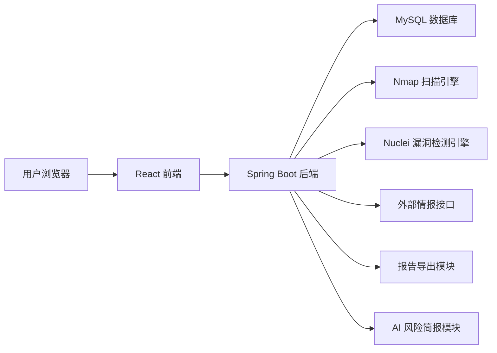

# ServerScout 服务器资产攻击面管理与风险分析平台

## 项目简介

ServerScout 是一个基于 Spring Boot、React、Nmap 与 Nuclei 构建的服务器资产攻击面管理与风险分析平台，围绕资产发现、端口与服务识别、漏洞检测、威胁情报查询、攻击面拓扑可视化、风险报告导出与 AI 风险简报生成等场景展开，帮助使用者将分散的扫描结果整理为可分析、可追踪、可展示的安全风险视图。

## 项目定位

- 这是一个面向安全分析与资产治理场景的个人独立工程项目。
- 项目适合用于毕业设计展示、Java 全栈项目作品集和前后端分离实践说明。
- 项目重点展示扫描工具集成、风险数据聚合、权限认证、可视化分析与文档工程化能力。

## 核心功能

- 资产发现与资产台账管理
- 端口扫描与服务识别
- 漏洞检测与风险分级
- Web 指纹识别
- 蜜罐识别
- 威胁情报查询
- 攻击面拓扑可视化
- 扫描任务管理与实时进度追踪
- PDF / Excel 风险报告导出
- AI 风险简报生成
- 用户认证、权限控制与操作日志记录

## 项目亮点

- 采用前后端分离架构，后端负责扫描编排、数据聚合与报告生成，前端负责风险可视化与交互分析。
- 集成 Nmap 完成端口与服务探测，并将结果沉淀为资产画像。
- 集成 Nuclei 完成漏洞模板检测，支持漏洞归档、分级与详情展示。
- 结合 CVE、CVSS、EPSS 等信息辅助风险研判。
- 使用 ECharts、G6、D3.js 展示资产拓扑和攻击面关系。
- 提供 PDF / Excel 报告导出能力，便于结果汇报与项目验收。
- 支持 AI 风险简报，将技术扫描结果转换为更易阅读的风险摘要。
- 后端具备统一异常处理、统一响应结构与 JWT 认证机制。
- 提供 Docker Compose 启动方式，便于快速搭建基础运行环境。

## 系统架构



## 技术栈

| 层级 | 技术 |
| --- | --- |
| 前端 | React 18、TypeScript、Vite、Tailwind CSS、Ant Design、ECharts、G6、D3.js |
| 后端 | Java 17、Spring Boot 3、Spring Security、JWT、JPA / Hibernate |
| 数据库 | MySQL 8.0、Redis |
| 扫描工具 | Nmap、Nuclei |
| 报告导出 | PDF、Excel |
| AI 能力 | OpenAI 兼容接口、本地规则分析兜底 |
| 部署 | Docker、Docker Compose、Shell |

## 扫描流程

```text
创建扫描任务
-> 校验目标资产
-> 调用 Nmap 执行端口与服务探测
-> 调用 Nuclei 执行漏洞检测
-> 解析扫描结果
-> 存储资产、端口、服务、漏洞和风险数据
-> 前端展示资产拓扑与风险列表
-> 导出 PDF / Excel 报告
-> 生成 AI 风险简报
```

## 仓库结构

```text
.
├── backend/                 # Spring Boot 后端服务
├── frontend/                # React 前端项目
├── docs/                    # 中文项目文档
├── prototype/               # 原型页面与演示资源
├── .github/                 # CI 工作流
├── docker-compose.yml       # 容器编排配置
├── Dockerfile               # 镜像构建配置
├── deploy.sh                # 部署辅助脚本
├── serverscout-init.sql     # 数据库初始化脚本
├── .env.example             # 环境变量示例
├── .gitignore               # Git 忽略规则
└── README.md                # 仓库首页说明
```

## 快速启动

### 环境要求

- Java 17+
- Maven 3.9+
- Node.js 18+
- MySQL 8.0+
- 可选：Redis、Nmap、Nuclei

### 数据库初始化

```bash
mysql -u root -p < serverscout-init.sql
```

### 启动后端

```bash
cd backend
mvn spring-boot:run -Dspring-boot.run.profiles=dev
```

默认地址：

- API：`http://localhost:8080`
- Swagger / OpenAPI：`http://localhost:8080/docs`

### 启动前端

```bash
cd frontend
npm install
npm run dev
```

默认地址：

- 前端页面：`http://localhost:5173`
- AI 风险简报：`http://localhost:5173/ai-briefing`

### 使用 Docker Compose 启动

```bash
docker-compose up -d --build
```

### 常见提示

- 若未安装 Nmap 或 Nuclei，扫描功能无法执行，但前后端基础页面仍可启动。
- 若需导出包含中文内容的 PDF，请确认系统已安装可用的中文字体，并正确配置 `PDF_FONT_PATH`。
- 首次运行前请根据 `.env.example` 或应用配置调整数据库与 JWT 相关环境变量。

## 环境变量

| 变量名 | 说明 |
| --- | --- |
| `SERVER_PORT` | 后端服务端口 |
| `SPRING_DATASOURCE_URL` | MySQL 连接地址 |
| `SPRING_DATASOURCE_USERNAME` | 数据库用户名 |
| `SPRING_DATASOURCE_PASSWORD` | 数据库密码 |
| `JWT_SECRET` | JWT 签名密钥 |
| `NMAP_PATH` | Nmap 可执行文件路径 |
| `NUCLEI_PATH` | Nuclei 可执行文件路径 |
| `AI_BASE_URL` | AI 接口地址 |
| `AI_API_KEY` | AI 接口密钥 |
| `PDF_FONT_PATH` | PDF 中文字体路径 |

## 文档导航

- [项目介绍](docs/项目介绍.md)
- [技术架构](docs/技术架构.md)
- [本地启动](docs/本地启动.md)
- [功能清单](docs/功能清单.md)
- [部署说明](docs/部署说明.md)
- [接口说明](docs/接口说明.md)
- [测试与验收](docs/测试与验收.md)
- [面试讲解](docs/面试讲解.md)

## 安全声明

本项目仅用于授权资产的安全检测、学习研究和毕业设计展示。使用 Nmap、Nuclei 等工具前，请确认目标资产归属明确并已获得授权。严禁将本项目用于未授权扫描、攻击、入侵或破坏第三方系统。

## 后续规划

- 完善更多扫描模板与插件化能力
- 增加更细粒度的任务调度和权限控制
- 补充更完整的审计、告警与报表能力
- 优化 AI 风险简报的上下文提取与结构化输出质量

## 作者

作者：18307519324az  
GitHub：https://github.com/18307519324az
