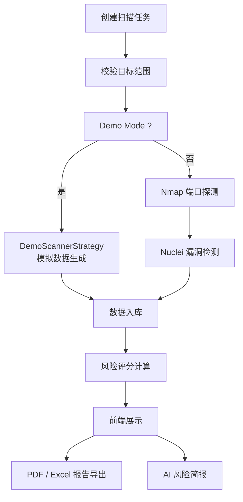

# 项目介绍

## 项目背景

在服务器资产治理与安全巡检场景中，扫描结果通常分散在端口探测、漏洞检测、情报查询和人工记录之间，缺少统一的资产视图与风险归档方式。ServerScout 的目标是把这些分散结果整合为可跟踪、可分析、可展示的统一平台。

## 解决的问题

- 资产信息分散，难以形成统一台账
- 扫描结果与漏洞信息缺少关联展示
- 端口、服务、漏洞、证书和情报数据难以放在同一视图中分析
- 安全报告整理成本高，人工汇总重复度高
- 技术扫描结果不易转化为更易阅读的风险说明

## 项目目标

- 建立统一的服务器资产与风险管理平台
- 打通资产发现、扫描执行、数据归档、风险展示和报告输出流程
- 为毕业设计与工程展示提供完整的全栈项目案例

## 核心流程

## 功能模块

- **仪表盘**：资产概况、风险评分、端口分布、趋势图、风险资产 Top 5
- **资产管理**：资产列表与详情、端口/服务/Web 指纹/SSL 证书/蜜罐检测、攻击面拓扑
- **扫描任务**：任务创建（quick/full/nuclei）、实时进度追踪、阶段状态机展示、日志查看
- **漏洞管理**：漏洞列表与详情、CVE 关联、CVSS/EPSS 评分、状态追踪
- **风险评分**：5 因子量化评分、风险原因与修复建议、按任务/资产维度查询
- **威胁情报**：IP 情报、域名情报、CVE 查询、Censys/VirusTotal 集成
- **报告导出**：PDF 报告（含概览+阶段+风险+漏洞+修复建议）、Excel 多维报告（7 Sheet）
- **AI 风险简报**：自由格式证据输入 → 结构化风险摘要，支持 LLM 与本地分析
- **系统设置**：个人信息、扫描工具路径、API 密钥、Webhook、定时扫描、用户管理、操作日志

## 使用场景

- 授权资产的安全巡检与基础风险梳理
- 安全分析课程或毕业设计展示
- Java 后端与 React 前端整合项目展示
- Nmap / Nuclei 扫描工具集成实践

## 项目价值

- 将安全扫描结果从原始输出转化为可持续维护的资产与风险数据
- 兼顾工程实现、业务流程和文档展示，适合作为正式项目案例
- 便于演示扫描工具接入、全栈协作和可视化分析能力

## 项目边界

- 本项目面向授权资产安全分析，不提供未授权攻击能力
- AI 风险简报用于辅助说明，不替代人工安全判断
- 项目不宣称企业级生产落地、真实客户案例或线上规模数据

## 作者

作者：18307519324az  
GitHub：https://github.com/18307519324az/ServerScout
