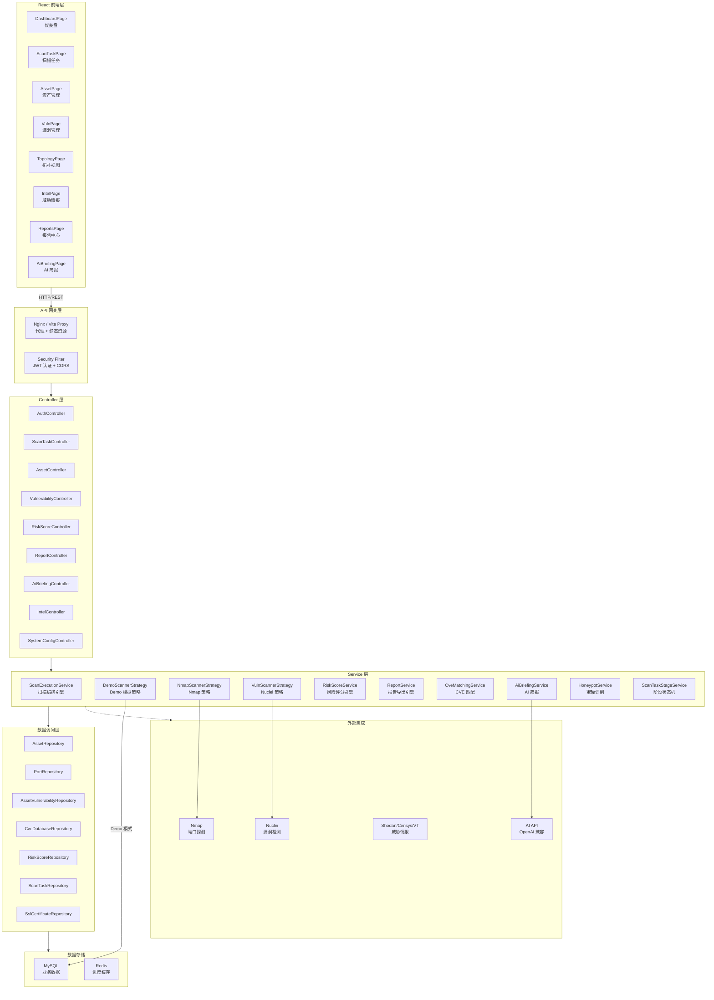
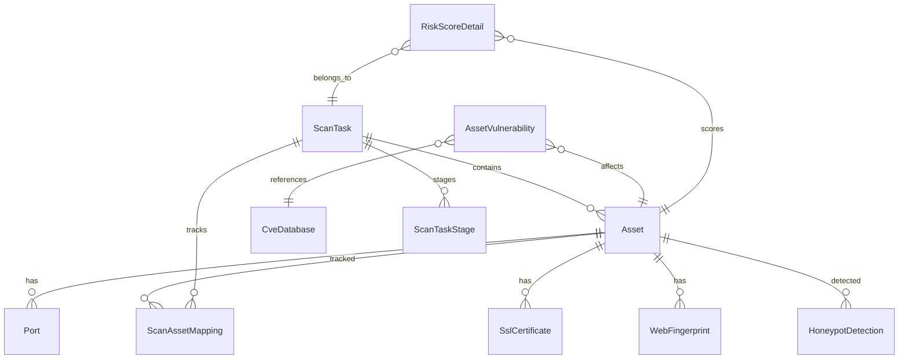

# 系统架构

## 总体架构

ServerScout 采用前后端分离架构。前端负责资产、漏洞、拓扑和报告等页面展示，后端负责认证授权、任务编排、扫描执行、数据聚合与导出能力，MySQL 负责持久化，Nmap 与 Nuclei 负责底层扫描。

## 前端架构

- **技术栈**：React 18、TypeScript、Vite、Tailwind CSS、Ant Design
- **状态管理**：`@tanstack/react-query` 管理服务端状态，React Context 管理客户端状态
- **路由**：React Router v6，懒加载页面组件
- **国际化**：react-i18next，支持中英文
- **可视化**：
  - ECharts：仪表盘图表、攻击面雷达图
  - G6：拓扑图
  - D3.js：攻击面地图
- **主要页面**：
  - 登录/注册 → 仪表盘 → 资产管理 → 扫描任务 → 漏洞管理 → 拓扑 → 攻击面 → 情报 → 报告中心 → AI 简报 → 系统设置 → 组件手册

## 后端架构

- **技术栈**：Java 17、Spring Boot 3.3.5、Spring Security 6、JPA / Hibernate、JWT
- **三层架构**：Controller → Service → Repository
- **认证授权**：Spring Security + JWT Token，角色区分 ADMIN/USER
- **统一响应**：`ApiResponse<T>` 统一结构 + `GlobalExceptionHandler` 统一异常处理
- **扫描引擎**：策略模式（`ScannerStrategy` 接口），支持 DemoScannerStrategy / NmapScannerStrategy / VulnScannerStrategy

### Controller 模块

| 模块 | Controller | 路径 |
|------|-----------|------|
| 认证 | AuthController | `/api/auth/**` |
| 用户 | UserController | `/api/v1/users/**` |
| 资产管理 | AssetController | `/api/v1/assets/**` |
| 扫描任务 | ScanTaskController | `/api/v1/scan-tasks/**` |
| 漏洞管理 | VulnerabilityController | `/api/v1/vulnerabilities/**` |
| 风险评分 | RiskScoreController | `/api/v1/risk-scores/**` |
| 报告导出 | ReportController | `/api/v1/reports/**` |
| 威胁情报 | IntelController | `/api/v1/intel/**` |
| AI 简报 | AiBriefingController | `/api/v1/ai-briefing/**` |
| 系统配置 | SystemConfigController | `/api/v1/config/**` |

### Service 模块

| 服务 | 职责 |
|------|------|
| ScanExecutionService | 扫描编排与执行流程控制 |
| DemoScannerStrategy | Demo Mode 模拟数据生成 |
| NmapScannerStrategy | Nmap 端口探测执行与结果解析 |
| VulnScannerStrategy | Nuclei 漏洞检测执行与结果解析 |
| ScanTaskStageService | 阶段状态机管理 |
| RiskScoreService | 风险评分计算与查询 |
| ReportService | PDF / Excel 报告导出 |
| CveMatchingService | CVE 版本匹配 |
| AiBriefingService | AI 风险简报生成 |
| HoneypotService | 蜜罐检测 |

## 数据库设计概览

核心实体：

| 实体 | 说明 |
|------|------|
| `ScanTask` | 扫描任务，含目标范围、扫描类型、状态、进度 |
| `Asset` | 资产，含 IP、主机名、操作系统、标签 |
| `Port` | 端口，含端口号、协议、服务名、版本、Banner |
| `AssetVulnerability` | 资产与漏洞关联，含状态、复现步骤 |
| `CveDatabase` | CVE 知识库，含 CVE ID、CVSS、受影响软件版本范围 |
| `RiskScoreDetail` | 风险评分结果，含 5 个子分数、风险等级、风险原因 |
| `ScanTaskStage` | 扫描阶段记录，含阶段编码、状态、进度、耗时 |
| `SslCertificate` | SSL 证书信息 |
| `WebFingerprint` | Web 指纹信息 |
| `HoneypotDetection` | 蜜罐检测结果 |

## 安全设计

- **认证**：Spring Security + JWT，登录发放 Token，请求拦截验证
- **授权**：`ROLE_ADMIN` 与 `ROLE_USER` 两级角色，Admin 可管理用户和查看全部数据
- **密码安全**：BCryptPasswordEncoder 加密存储
- **接口保护**：未认证请求返回 401 JSON，权限不足返回 403 JSON
- **操作审计**：`OperationLog` 记录用户关键操作
- **异常隔离**：`GlobalExceptionHandler` 统一处理异常，不暴露底层细节
- **密码加密传输**：登录注册密码使用 RSA 公钥加密后传输

## 异常处理设计

- 业务异常使用 `BusinessException`，携带 ErrorCode
- `GlobalExceptionHandler` 捕获并返回统一 `ApiResponse` 结构
- 认证异常由 `AuthenticationEntryPoint` 处理，返回 401
- 权限异常由 `AccessDeniedHandler` 处理，返回 403
- 参数校验失败返回 400，资源不存在返回 404

## 可扩展方向

- 扫描插件化与任务模板能力增强
- 分布式任务调度与更细粒度限流
- 更完整的威胁情报接入
- 更丰富的报表模板与导出格式
- 实时 WebSocket 推送替代轮询
