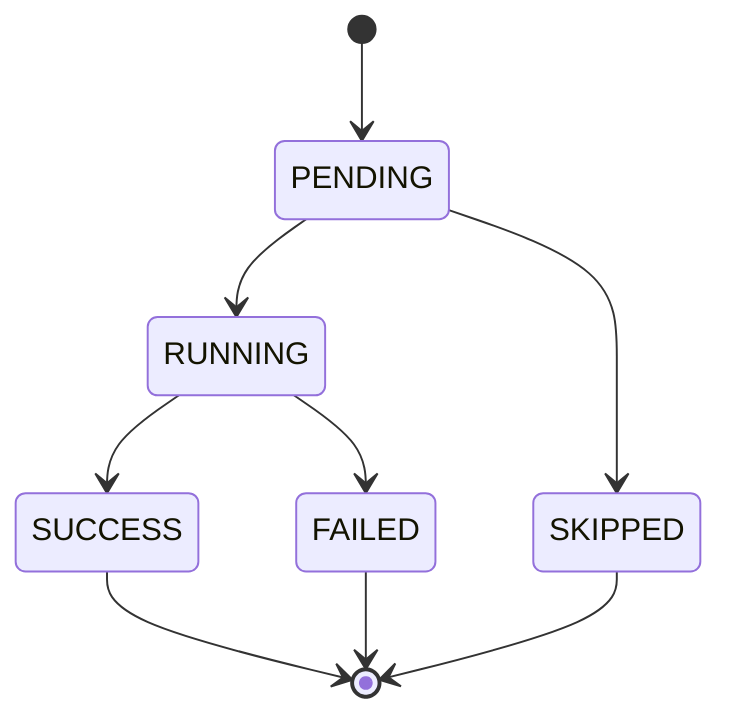
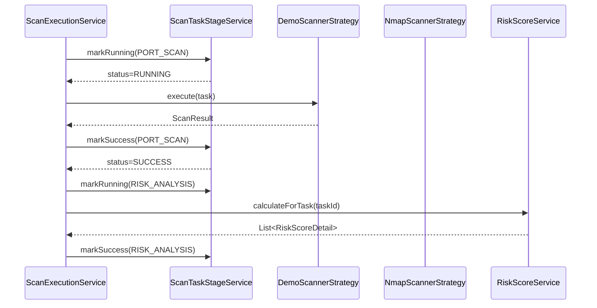

# 扫描阶段状态机

## 概述

ServerScout 的扫描任务划分为 9 个按序执行的阶段（Stage），每个阶段有独立的状态跟踪。前端通过 SSE 或轮询获取阶段进度，实现细粒度的扫描过程可视化。

## 9 个阶段

```mermaid
flowchart LR
    A["TARGET_VALIDATION<br/><b>目标校验</b>"] -->|10%| B["PORT_SCAN<br/><b>端口扫描</b>"]
    B -->|25%| C["SERVICE_FINGERPRINT<br/><b>服务识别</b>"]
    C -->|40%| D["WEB_PROBE<br/><b>Web 探测</b>"]
    D -->|57%| E["VULNERABILITY_SCAN<br/><b>漏洞检测</b>"]
    E -->|57%| F["CVE_MATCH<br/><b>CVE 匹配</b>"]
    F -->|75%| G["RISK_ANALYSIS<br/><b>风险分析</b>"]
    G -->|90%| H["RESULT_SAVE<br/><b>结果保存</b>"]
    H -->|100%| I["NOTIFICATION<br/><b>通知回调</b>"]
```



## 阶段状态

每个阶段有 5 种状态：



| 状态 | 含义 |
|------|------|
| `PENDING` | 等待执行 |
| `RUNNING` | 正在执行 |
| `SUCCESS` | 执行成功 |
| `FAILED` | 执行失败 |
| `SKIPPED` | 跳过（条件不满足） |

## 阶段详情

### 1. TARGET_VALIDATION — 目标校验

- **职责**：校验扫描目标格式，解析 IP 范围或域名
- **成功条件**：目标格式合法，至少一个可扫描 IP
- **失败处理**：标记 FAILED，记录错误信息，终止后续阶段
- **Demo Mode**：快速通过（300ms），生成示例 IP
- **Real Mode**：调用 Nmap ping 扫描验证目标可达性

### 2. PORT_SCAN — 端口扫描

- **职责**：执行端口探测，发现开放端口与服务
- **成功条件**：扫描完成，至少记录端口数据（可能为空）
- **失败处理**：标记 FAILED，已发现的端口仍保留
- **Demo Mode**：从预置端口池选取 2-8 个端口
- **Real Mode**：调用 Nmap 执行端口扫描

### 3. SERVICE_FINGERPRINT — 服务识别

- **职责**：识别端口对应服务的名称、版本、Banner
- **成功条件**：端口扫描已完成
- **失败处理**：部分端口无版本信息仍视为成功
- **Demo Mode**：从预置服务池选取匹配的服务版本
- **Real Mode**：解析 Nmap 详细输出中的版本信息

### 4. WEB_PROBE — Web 探测

- **职责**：识别 HTTP/HTTPS 端口的 Web 指纹、标题、技术栈
- **成功条件**：至少一个 Web 端口被探测（或跳过）
- **失败处理**：标记 SKIPPED（无 Web 端口），不影响后续
- **Demo Mode**：Web 端口自动填充指纹数据
- **Real Mode**：通过 HTTP 请求获取响应头和页面信息

### 5. VULNERABILITY_SCAN — 漏洞检测

- **职责**：执行漏洞模板检测，发现安全漏洞
- **成功条件**：扫描完成（可能 0 漏洞）
- **失败处理**：标记 FAILED，已发现的漏洞仍保留
- **Demo Mode**：按扫描类型生成 1-8 个模拟漏洞
- **Real Mode**：调用 Nuclei 执行模板检测

### 6. CVE_MATCH — CVE 匹配

- **职责**：将检测到的漏洞与 CveDatabase 中的 CVE 记录关联
- **成功条件**：匹配完成（可能 0 匹配）
- **失败处理**：不阻塞流程，漏洞记录仍保留
- **Demo Mode**：直接引用 CveDatabase 中的 CVE ID
- **Real Mode**：按软件名称+版本号匹配 CVE

### 7. RISK_ANALYSIS — 风险分析

- **职责**：计算资产风险评分，生成风险原因与修复建议
- **成功条件**：所有资产评分完成
- **失败处理**：标记 FAILED，不影响已有资产/端口/漏洞数据
- **Demo Mode**：调用真实 `RiskScoreService` 计算评分
- **Real Mode**：同 Demo Mode，调用真实评分引擎

### 8. RESULT_SAVE — 结果保存

- **职责**：最终保存扫描结果，更新任务状态为 `completed`
- **成功条件**：数据写入完成
- **失败处理**：标记 FAILED，任务状态不更新为完成
- **Demo Mode**：正常保存
- **Real Mode**：正常保存

### 9. NOTIFICATION — 通知回调

- **职责**：通过 Webhook 推送扫描结果摘要
- **成功条件**：通知发送完成（或未配置通知）
- **失败处理**：不影响扫描结果
- **Demo Mode**：触发 Webhook（如已配置）
- **Real Mode**：触发 Webhook（如已配置）

## 阶段状态数据模型

```java
@Entity
@Table(name = "scan_task_stage")
public class ScanTaskStage {
    private Long id;
    private Long taskId;
    private ScanStageCode stageCode;    // 阶段编码
    private String stageName;           // 阶段名称
    private ScanStageStatus status;     // 状态：PENDING/RUNNING/SUCCESS/FAILED/SKIPPED
    private int progress;               // 进度百分比
    private Instant startedAt;          // 开始时间
    private Instant finishedAt;         // 结束时间
    private Long durationMs;            // 耗时（毫秒）
    private String summary;             // 阶段摘要
    private String errorMessage;        // 错误信息
}
```

## 阶段状态管理



## 前端展示

前端通过 `fetchScanTaskStages(taskId)` 获取阶段列表，以进度条+列表形式展示每个阶段的状态和耗时。正在运行的阶段显示旋转图标，失败的阶段显示红色标记并附有错误信息。
