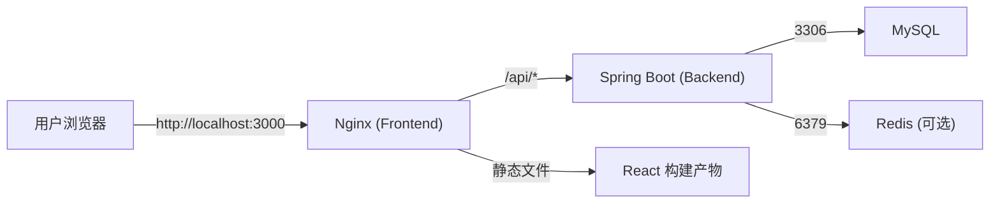

# Docker 部署说明

## 概述

ServerScout 支持通过 Docker Compose 一键部署完整环境，包含 MySQL 数据库、Spring Boot 后端和 React 前端三个服务。

## 前置要求

- Docker Engine 24+
- Docker Compose 2+
- 至少 2GB 可用内存

## 快速启动

```bash
# 克隆仓库
git clone https://github.com/18307519324az/ServerScout.git
cd ServerScout

# 复制环境变量
cp .env.example .env

# 启动所有服务
docker-compose up -d --build

# 查看容器状态
docker-compose ps

# 查看日志
docker-compose logs -f
```

## 服务端口

| 服务 | 容器内端口 | 映射端口 | 说明 |
|------|-----------|----------|------|
| MySQL | 3306 | 3307 | 数据库，避免与本机 MySQL 冲突 |
| Backend | 8080 | 8080 | Spring Boot API |
| Frontend | 80 | 3000 | Nginx 静态资源 + API 代理 |

## 环境变量配置

在 `.env` 文件中配置以下变量（`cp .env.example .env` 后按需修改）：

| 变量名 | 默认值 | 说明 |
|--------|--------|------|
| `MYSQL_ROOT_PASSWORD` | `please_change_me` | MySQL root 密码 |
| `MYSQL_DATABASE` | `serverscout` | 数据库名 |
| `SPRING_DATASOURCE_URL` | `jdbc:mysql://mysql:3306/serverscout` | 后端数据库连接地址 |
| `SPRING_DATASOURCE_USERNAME` | `serverscout` | 数据库用户 |
| `SPRING_DATASOURCE_PASSWORD` | `please_change_me` | 数据库密码 |
| `JWT_SECRET` | `please-change-this-secret-in-production` | JWT 签名密钥 |
| `SCANNER_DEMO_MODE` | `true` | 是否启用 Demo Mode |
| `NMAP_PATH` | `/usr/bin/nmap` | Nmap 路径（仅在非 Demo 模式需要） |
| `NUCLEI_PATH` | `/usr/bin/nuclei` | Nuclei 路径（仅在非 Demo 模式需要） |
| `PDF_FONT_PATH` | `/usr/share/fonts/truetype/noto/NotoSansCJK-Regular.ttc` | PDF 中文字体路径 |

### 运行模式切换示例

Demo Mode（默认）：

```env
SCANNER_DEMO_MODE=true
SCANNER_ALLOW_PUBLIC_TARGETS=false
```

Real Mode（真实扫描）：

```env
SCANNER_DEMO_MODE=false
SCANNER_ALLOW_PUBLIC_TARGETS=false
NMAP_PATH=nmap
NUCLEI_PATH=nuclei
```

切换后重启服务：

```bash
docker compose down
docker compose up -d --build
```

## 容器架构



## Dockerfile

后端 `Dockerfile` 采用多阶段构建：

1. **build 阶段**：使用 Maven 构建 Jar 包
2. **runtime 阶段**：使用 `eclipse-temurin:17-jre` 运行 Jar 包，安装 Nmap + Nuclei + Noto Sans CJK 字体

前端 `Dockerfile`：

1. **build 阶段**：Node.js 20 安装依赖并执行 `npm run build`
2. **runtime 阶段**：Nginx Alpine 提供静态文件

## docker-compose.yml

```yaml
services:
  mysql:
    image: mysql:8.0
    environment:
      MYSQL_ROOT_PASSWORD: ${MYSQL_ROOT_PASSWORD}
      MYSQL_DATABASE: ${MYSQL_DATABASE}
    ports:
      - "3307:3306"
    volumes:
      - mysql_data:/var/lib/mysql
    healthcheck:
      test: ["CMD", "mysqladmin", "ping", "-h", "localhost"]

  backend:
    build: .
    depends_on:
      mysql:
        condition: service_healthy
    environment:
      - SPRING_DATASOURCE_URL=jdbc:mysql://mysql:3306/serverscout
      - SPRING_DATASOURCE_USERNAME=root
      - SPRING_DATASOURCE_PASSWORD=${MYSQL_ROOT_PASSWORD}
      - SCANNER_DEMO_MODE=${SCANNER_DEMO_MODE}
      - JWT_SECRET=${JWT_SECRET}
    ports:
      - "8080:8080"

  frontend:
    build: frontend
    ports:
      - "3000:80"
    depends_on:
      - backend

volumes:
  mysql_data:
```

## 验证部署

```bash
# 检查容器状态
docker-compose ps

# 后端健康检查
curl http://localhost:8080/actuator/health

# Demo Mode 检查
curl http://localhost:8080/api/v1/config/demo-mode

# 前端页面
curl http://localhost:3000
```

## 常见问题

### 端口冲突

如果本机已运行 MySQL（3306）或后端（8080），请在 `docker-compose.yml` 中修改映射端口。

### 数据库初始化

首次启动后，后端会自动通过 JPA `ddl-auto: update` 创建表结构。如果需要初始化演示数据，执行 `serverscout-init.sql`。

### 中文字体缺失

如果 PDF 报告中文显示为方块，请确认：
1. Docker 镜像中已安装中文字体
2. `PDF_FONT_PATH` 环境变量指向正确的字体文件路径

### Docker Desktop 不可用

如果当前环境没有 Docker Desktop，可以分别启动后端和前端进行开发和测试。
