# ServerScout 用户使用手册

> **版本**: v1.0 | **更新日期**: 2026-05-24 | **适用版本**: ServerScout 1.0

---

## 目录

1. [快速开始](#1-快速开始)
2. [管理员操作指南](#2-管理员操作指南)
3. [普通用户操作指南](#3-普通用户操作指南)
4. [核心功能详解](#4-核心功能详解)
5. [典型使用场景](#5-典型使用场景)
6. [常见问题与排错](#6-常见问题与排错)
7. [附录](#7-附录)

---

## 1. 快速开始

**目标读者**: 所有人  
**核心内容**: 环境要求、安装启动、首次登录

### 1.1 环境要求

| 组件 | 版本要求 | 说明 |
|------|---------|------|
| Java JDK | 17+ | 后端运行环境 |
| Maven | 3.9+ | 后端构建工具 |
| Node.js | 18+ | 前端运行环境 |
| npm | 9+ | 前端包管理 |
| MySQL | 8.0+ | 数据库服务 |
| Nmap | 7.x+ (可选) | 端口扫描引擎 |
| Nuclei | 3.x+ (可选) | 漏洞扫描引擎 |

### 1.2 安装与启动

#### 后端启动

```bash
# 1. 创建数据库
mysql -u root -p -e "CREATE DATABASE IF NOT EXISTS serverscout CHARACTER SET utf8mb4 COLLATE utf8mb4_unicode_ci;"

# 2. 修改数据库连接配置 (如有需要)
# 编辑 serverscout/backend/src/main/resources/application.yml
# 修改 DB_URL, DB_USERNAME, DB_PASSWORD

# 3. 启动后端
cd serverscout/backend
mvn spring-boot:run

# 后端默认运行在 http://localhost:8080
# API 文档地址: http://localhost:8080/docs
```

#### 前端启动

```bash
cd serverscout/frontend
npm install
npm run dev

# 前端默认运行在 http://localhost:5173
```

### 1.3 首次登录

1. 打开浏览器访问 `http://localhost:5173`
2. 系统会自动跳转到登录页面

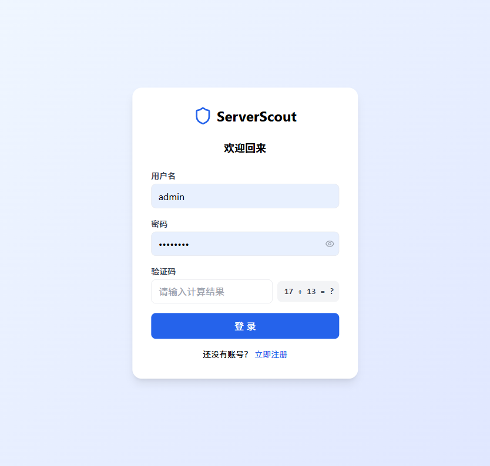

3. 输入默认管理员账号：

| 字段 | 值 |
|------|-----|
| 用户名 | `admin` |
| 密码 | `admin123` |
| 验证码 | 计算页面显示的数学题答案 |

4. 点击 **登 录** 按钮进入系统

> **安全提示**: 首次登录后请立即修改默认密码！详见 [修改密码](#22-修改密码)。

### 1.4 登录后的首页

登录成功后进入仪表盘，展示系统概览统计信息。

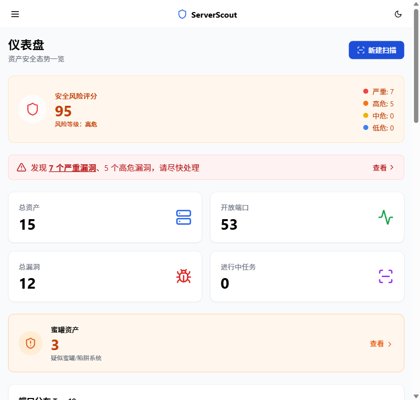

---

## 2. 管理员操作指南

**目标读者**: 管理员  
**核心内容**: 用户管理、扫描配置、系统设置

管理员拥有系统的最高权限，可以管理用户、配置扫描工具、设置通知等。所有管理功能统一在 **设置** 页面。

### 2.1 用户管理

导航到 **设置** 页面，滚动到 **用户管理** 区域。

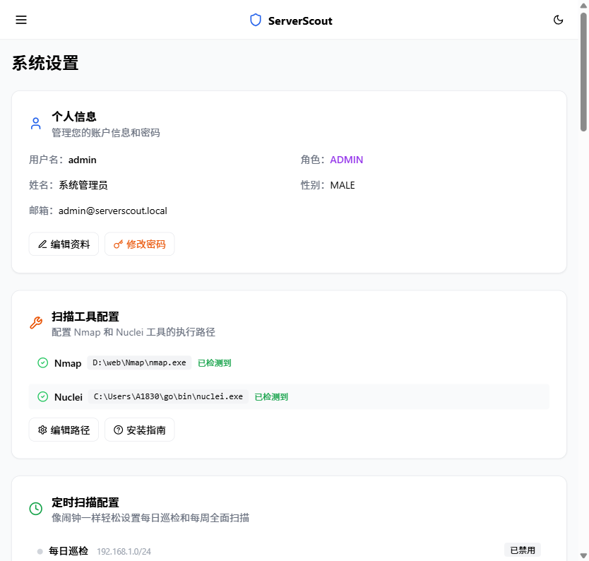

#### 添加用户

1. 点击 **添加用户** 按钮
2. 填写用户名、密码、姓名、角色（ADMIN/USER）、邮箱
3. 点击确认完成创建

> 系统预设角色：**ADMIN**（管理员）和 **USER**（普通用户）

#### 编辑用户

点击用户行的 **编辑** 按钮，可修改角色、姓名、邮箱、启用/禁用状态。

#### 重置密码

点击 **重置密码** 按钮，输入新密码即可。

#### 删除用户

点击 **删除** 按钮，确认后即可删除用户。

### 2.2 扫描工具配置

在设置页面 **扫描工具配置** 区域：

- 查看 Nmap 和 Nuclei 的检测状态
- 点击 **编辑路径** 修改工具执行路径
- 点击 **安装指南** 查看工具安装教程
- 点击 **检测工具** 重新检测工具是否可用

### 2.3 定时扫描配置

在设置页面 **定时扫描配置** 区域：

- 配置每日巡检（快速扫描）和每周全面扫描
- 支持 cron 表达式灵活设定执行时间
- 可启用/禁用定时任务

### 2.4 外部情报 API 配置

在设置页面 **外部情报 API 配置** 区域：

- 配置 **Censys API ID / Secret** 以启用 Censys 主机查询
- 配置 **VirusTotal API Key** 以启用恶意软件/IP 信誉查询
- 点击 **获取 API Key 教程** 了解如何申请

### 2.5 告警通知配置

在设置页面 **告警通知配置** 区域：

- 配置钉钉 (DingTalk)、飞书 (Feishu/Lark)、企业微信 (WeCom) Webhook 地址
- 扫描完成后自动推送结果摘要到指定群聊
- 支持全局通知开关

### 2.6 邮件通知配置

在设置页面 **邮件通知配置** 区域：

- 配置 SMTP 服务器信息
- 支持 SSL/TLS 加密连接
- 扫描完成后自动发送报告邮件

### 2.7 扫描策略插件 (L2)

在设置页面 **扫描策略插件** 区域：

- 管理自定义扫描策略（如 SSH 弱口令检测）
- 支持自定义命令模板和结果解析正则表达式
- 可启用/禁用/编辑/删除插件
- 点击 **添加策略** 创建新插件

### 2.8 操作日志

在设置页面底部 **操作日志** 区域：

- 查看所有用户的操作记录（登录、API 调用等）
- 支持按用户名和操作类型筛选
- 显示 IP 地址和归属地信息
- 支持导出 CSV 和 Excel 格式

---

## 3. 普通用户操作指南

**目标读者**: 普通用户  
**核心内容**: 创建扫描、查看结果、分析漏洞

### 3.1 创建扫描任务

1. 点击左侧导航栏 **扫描任务**
2. 点击 **新建扫描** 按钮

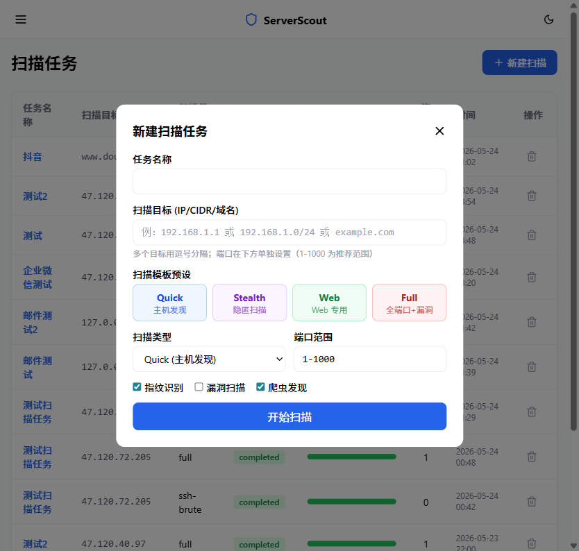

3. 填写扫描参数：

| 参数 | 说明 | 示例 |
|------|------|------|
| 任务名称 | 便于识别的名称 | `生产环境巡检` |
| 扫描目标 | IP 地址、域名或CIDR网段 | `192.168.1.1` / `example.com` / `10.0.0.0/24` |
| 扫描类型 | quick（快速）/ full（全面）/ 自定义插件 | `quick` |

4. 点击确认开始扫描

### 3.2 查看扫描任务列表

扫描任务页面展示所有已创建的任务，包括：

- 任务名称、扫描目标、扫描类型
- 状态（running/completed/failed/cancelled）
- 发现的资产数量
- 创建时间

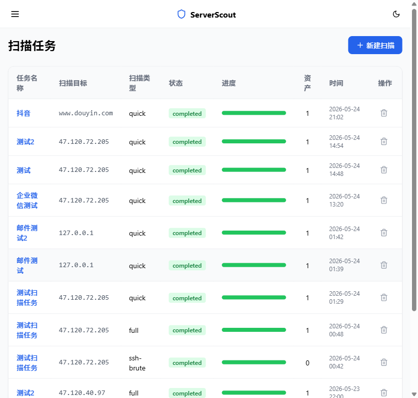

### 3.3 查看扫描任务详情

点击任务名称进入详情页，可查看：

- 扫描进度和状态
- 发现的资产列表
- 开放的端口和服务
- 检测到的漏洞
- Web 爬虫发现的 URL（如有）
- 网页截图（如有）

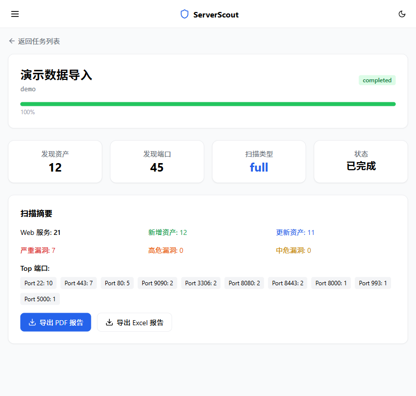

### 3.4 查看资产

点击左侧导航栏 **资产列表** 进入：

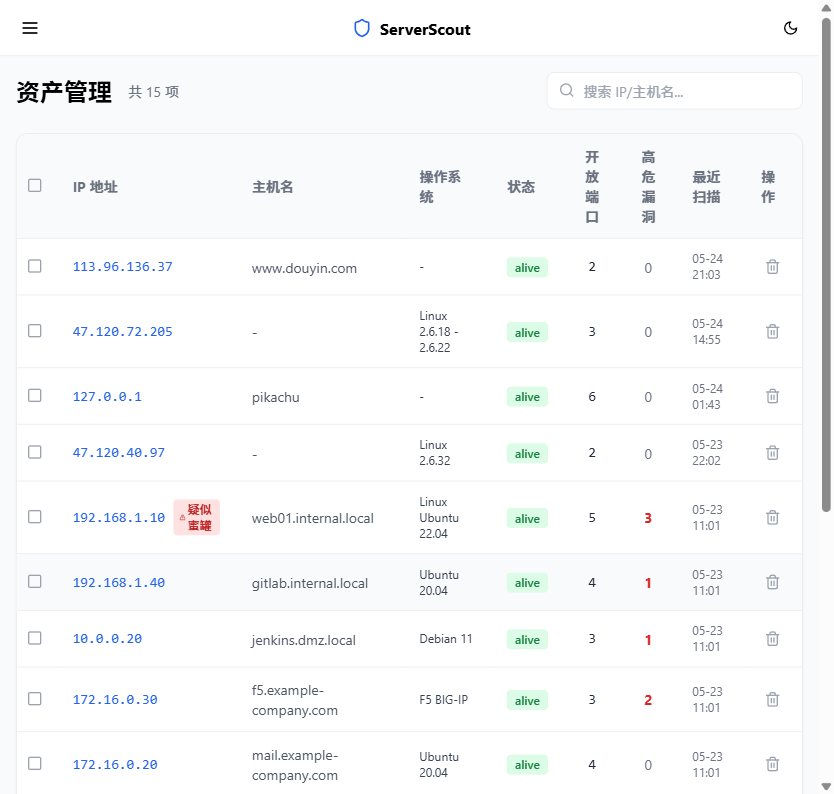

- 按状态（新建/已确认/已归档）筛选资产
- 按关键词搜索
- 查看每个资产的 IP、域名、开放端口数、漏洞数

#### 资产详情

点击资产进入详情页：

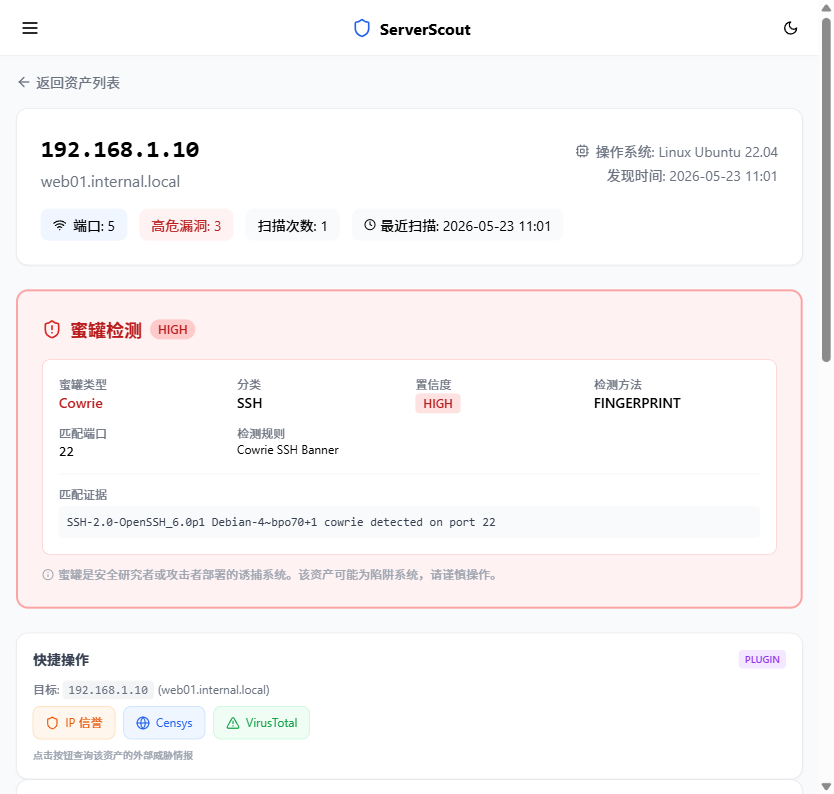

资产详情页展示：
- 基本信息（IP、域名、操作系统、标签等）
- 开放端口列表
- 关联漏洞列表
- Web 指纹信息
- SSL 证书信息
- 子域名信息
- 蜜罐检测结果
- Web 爬虫发现的 URL
- 网页截图

### 3.5 查看漏洞

点击左侧导航栏 **漏洞列表** 进入：

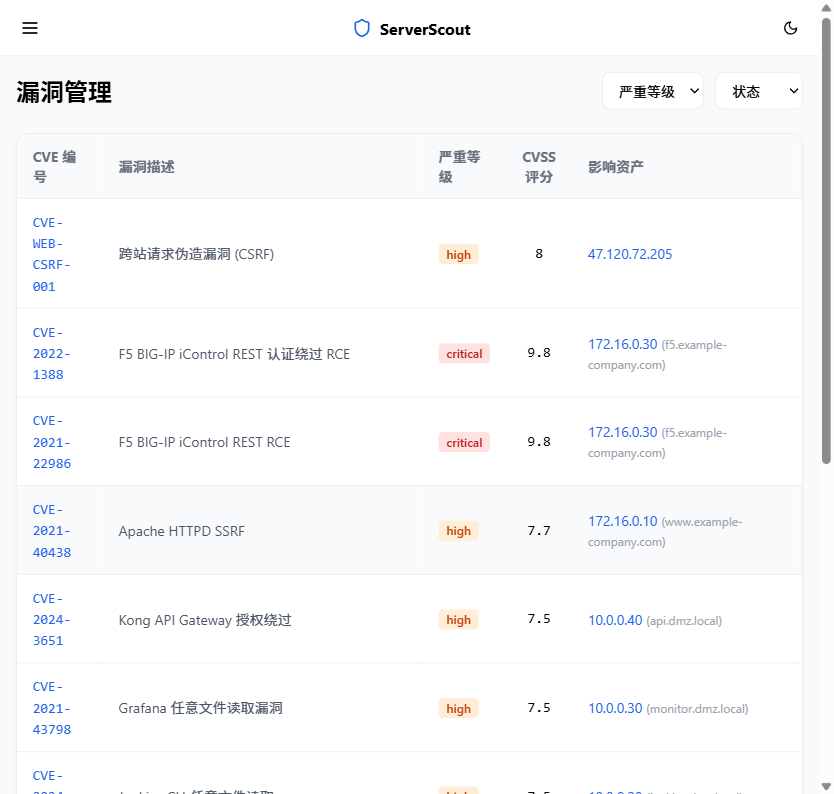

- 按严重程度（Critical/High/Medium/Low/Info）筛选
- 按状态（未处理/已确认/已修复/误报）筛选
- 查看 CVE 编号、CVSS 评分、影响资产

#### 漏洞详情

点击漏洞进入详情页：

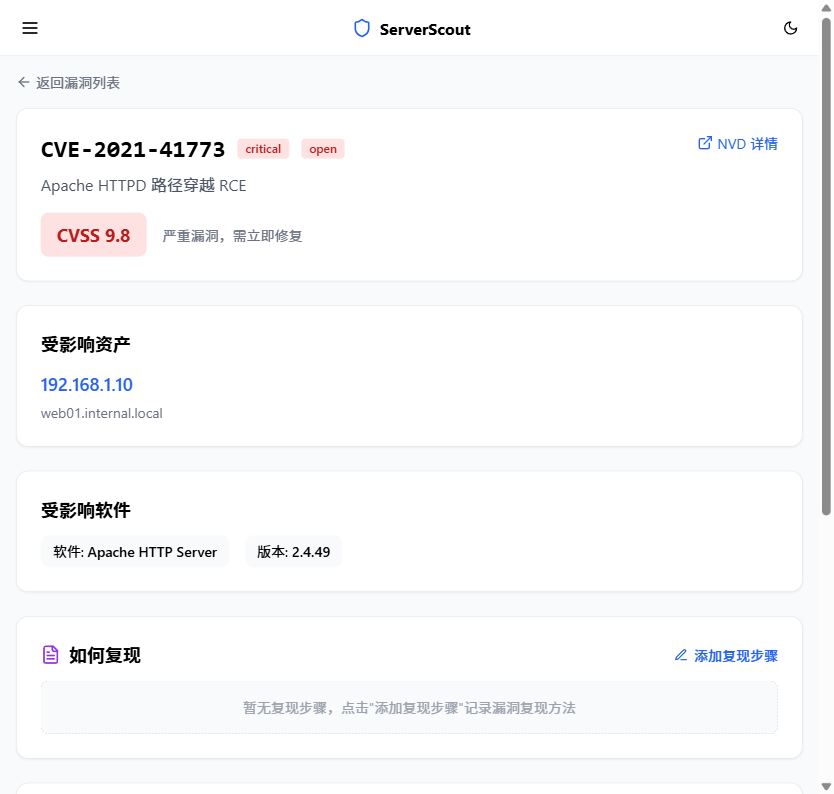

漏洞详情页展示：
- 漏洞描述和 CVE 信息
- CVSS 评分和 EPSS 利用概率
- 影响的资产和端口
- 复现步骤
- 修复建议
- 状态变更历史日志

---

## 4. 核心功能详解

**目标读者**: 所有人  
**核心内容**: 仪表盘、资产拓扑、攻击面地图、报告导出

### 4.1 仪表盘

首页仪表盘提供系统全局概览：


**统计卡片区**:
- 总资产数、活跃扫描数、漏洞总数、高危漏洞数
- 蜜罐检测统计

**图表区域**:
- 漏洞趋势图
- 资产分布图
- 漏洞严重程度分布
- 最近扫描活动
- 技术栈分布

### 4.2 资产拓扑图

点击左侧导航栏 **资产拓扑** 进入：

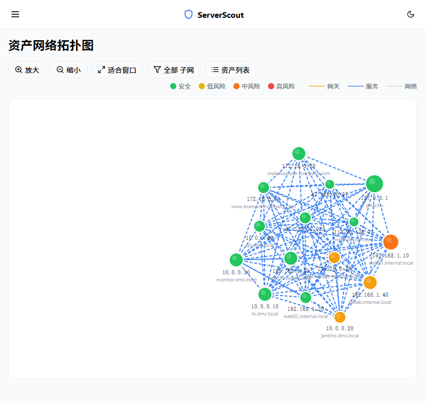

- 使用 **G6 图可视化引擎** 展示资产之间的关系
- 节点代表资产（不同颜色表示不同类型）
- 连线表示资产之间的网络关系
- 支持拖拽、缩放、点击查看详情

### 4.3 攻击面地图

点击左侧导航栏 **攻击面地图** 进入：

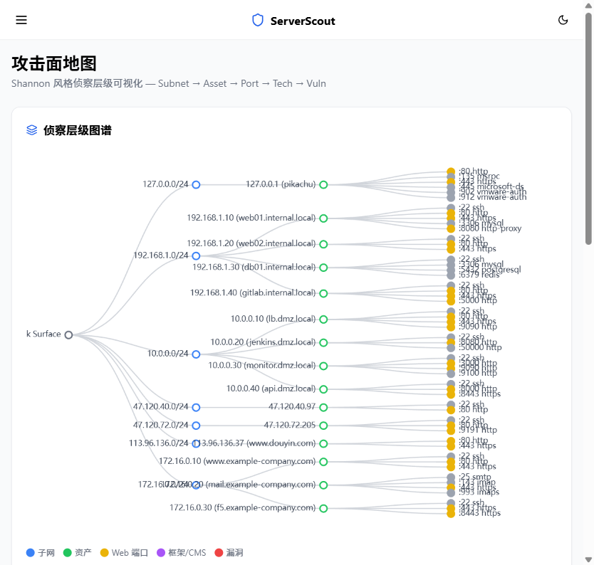

- 使用 **D3.js 力导向图** 可视化攻击面
- 展示端口、服务、漏洞之间的关联关系
- 支持交互式探索
- 帮助安全团队快速识别风险暴露面

### 4.4 外部威胁情报

点击左侧导航栏 **外部情报** 进入：

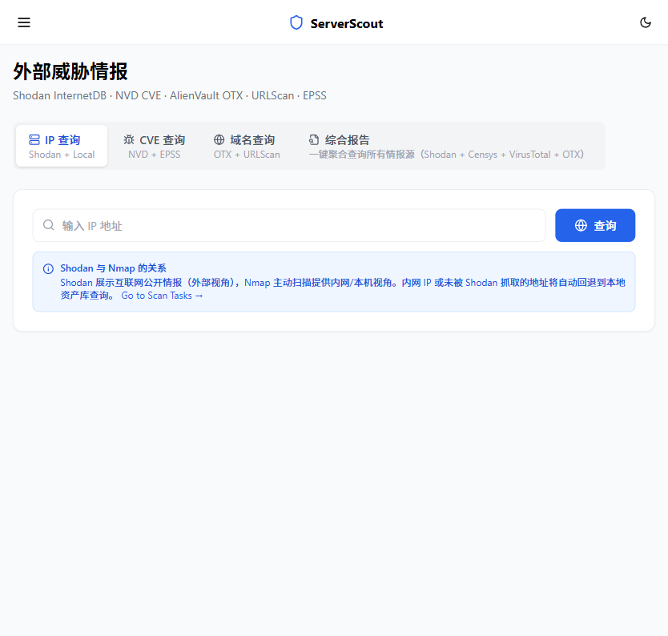

**功能包括**:
- **IP 情报查询**: 查询 IP 的归属地、ASN、运营商信息
- **CVE 查询**: 查看 CVE 详细信息、CVSS 评分、EPSS 评分
- **Censys 集成**: 查询互联网资产暴露信息
- **VirusTotal 集成**: 查询 IP/域名的恶意软件检测结果
- **域名情报**: 查询域名的 Whois、DNS 记录等信息
- **综合报告**: 对目标生成综合分析报告

### 4.5 报告中心

点击左侧导航栏 **报告中心** 进入：

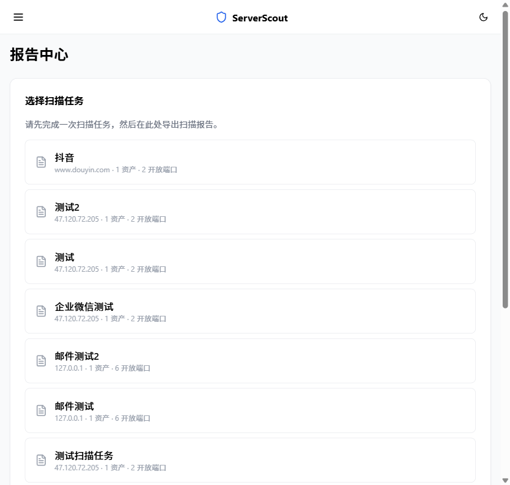

- **PDF 报告**: 按扫描任务生成详细的 PDF 安全评估报告
- **Excel 报告**: 导出结构化数据，便于二次分析
- 报告包含：资产清单、端口信息、漏洞详情、修复建议、扫描统计

---

## 5. 典型使用场景

**目标读者**: 所有人  
**核心内容**: 模拟一个完整的资产评估流程

### 场景：对新上线的 Web 应用进行安全评估

#### Step 1: 登录系统

打开 `http://localhost:5173`，使用管理员账号登录。


#### Step 2: 创建扫描任务

1. 进入 **扫描任务** 页面
2. 点击 **新建扫描**
3. 填写信息：
   - 任务名称：`新应用安全评估`
   - 扫描目标：`your-app.example.com`
   - 扫描类型：选择 `full`（全面扫描）
4. 点击确认提交


#### Step 3: 等待扫描完成

在扫描任务列表中观察任务状态从 `running` 变为 `completed`。


#### Step 4: 查看扫描结果

点击任务名称进入详情，查看发现的资产、端口和漏洞。


#### Step 5: 分析资产

进入 **资产列表**，查看新发现的资产详情：


- 检查开放端口和运行的服务
- 查看 SSL 证书是否过期
- 查看蜜罐检测结果，排除蜜罐干扰

#### Step 6: 处理漏洞

进入 **漏洞列表**，按严重程度排序：


1. 优先处理 **Critical** 和 **High** 级别漏洞
2. 点击漏洞查看详情和修复建议
3. 更新漏洞状态：未处理 → 已确认 → 已修复


#### Step 7: 查看攻击面

进入 **攻击面地图**，直观查看服务暴露情况：


#### Step 8: 导出报告

进入 **报告中心**，选择对应任务导出 PDF 报告：


#### Step 9: 查询外部情报（可选）

进入 **外部情报** 页面，查询目标 IP 的威胁情报信息：


---

## 6. 常见问题与排错

**目标读者**: 所有人

### Q1: 登录失败怎么办？

- 检查用户名和密码是否正确（默认: `admin` / `admin123`）
- 确保验证码计算正确
- 检查后端服务是否正常运行（访问 `http://localhost:8080/api/auth/captcha` 验证）
- 检查浏览器控制台是否有网络错误

### Q2: 扫描无结果？

- 检查目标 IP/域名是否可达（尝试 ping）
- 检查防火墙是否屏蔽了扫描端口
- 检查 Nmap/Nuclei 工具路径是否配置正确（设置 → 扫描工具配置）
- 切换到 `full` 扫描类型（`quick` 仅扫描常见端口）
- 查看扫描任务详情中的日志输出

### Q3: 端口占用问题？

后端默认端口 `8080`，前端默认端口 `5173`。如果端口被占用：

**后端端口修改**:
```bash
# 通过环境变量修改后端端口
SERVER_PORT=9090 mvn spring-boot:run
```

**前端端口修改**:
```javascript
// 修改 serverscout/frontend/vite.config.ts 中的 server.port
// 同时修改 proxy.target 指向后端新端口
```

### Q4: MySQL 连接失败？

- 确保 MySQL 服务已启动：`mysqladmin ping -u root -p`
- 检查数据库 `serverscout` 是否已创建
- 检查 `application.yml` 中的数据库连接配置
- 确认 MySQL 用户权限：`GRANT ALL ON serverscout.* TO 'root'@'localhost';`

### Q5: 如何重置管理员密码？

如果忘记管理员密码，可直接在数据库中重置（需要使用 MySQL）：

```sql
-- 密码存储为 BCrypt 加密，需要先通过工具生成新密文
-- 或使用系统提供的重置功能（需登录后操作）
UPDATE user SET password = '新BCrypt密文' WHERE username = 'admin';
```

或通过其他管理员账号登录后，在 **设置 → 用户管理** 中重置。

### Q6: PDF 报告中文乱码？

在 `application.yml` 中确保配置了正确的中文字体路径：

```yaml
app:
  pdf:
    font-path: ${PDF_FONT_PATH:C:/Windows/Fonts/msyh.ttc}
```

Windows 使用微软雅黑 (`msyh.ttc`)，Linux 可安装 `fonts-noto-cjk`。

### Q7: Nuclei 模板下载失败？

Nuclei 首次运行需要下载模板库。如果网络受限：

1. 手动下载模板：[Nuclei Templates GitHub](https://github.com/projectdiscovery/nuclei-templates)
2. 使用 `nuclei -update-templates` 更新
3. 配置网络代理（如有）

### Q8: 扫描速度太慢？

- 使用 `quick` 模式（仅扫描 Top 1000 端口）
- 扫描单个 IP 而非大段 CIDR
- 在设置中调整扫描超时和并发数

---

## 7. 附录

**目标读者**: 开发者

### 7.1 API 端点速查

所有 API 文档可通过 Swagger UI 访问：**`http://localhost:8080/docs`**

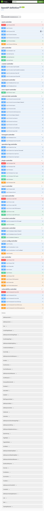

**API 概览**:

| 模块 | 前缀 | 主要端点 |
|------|------|---------|
| 认证 | `/api/auth` | POST `/login`, POST `/register`, GET `/captcha`, GET `/public-key` |
| 用户管理 | `/api/v1/users` | GET/POST `/`, GET/PUT/DELETE `/{id}`, GET `/me`, PUT `/me/password` |
| 资产管理 | `/api/v1/assets` | GET `/` (分页), GET `/{id}`, PUT `/{id}/tags`, DELETE `/{id}`, GET `/topology`, GET `/attack-surface`, POST `/merge` |
| 扫描任务 | `/api/v1/scan-tasks` | POST `/`, GET `/` (分页), GET `/{id}`, POST `/{id}/cancel`, DELETE `/{id}` |
| 漏洞管理 | `/api/v1/vulnerabilities` | GET `/` (分页), GET `/{id}`, PUT `/{id}/status`, PUT `/{id}/reproduction`, DELETE `/{id}`, GET `/{id}/logs` |
| 仪表盘 | `/api/v1/dashboard` | GET `/stats`, GET `/tech-stack` |
| 子域名 | `/api/v1/subdomains` | POST `/enumerate`, GET `/domain/{domain}`, GET `/asset/{assetId}` |
| 报告 | `/api/v1/reports` | GET `/pdf?taskId=`, GET `/excel?taskId=` |
| 外部情报 | `/api/v1/intel` | GET `/ip/{ip}`, GET `/cve/{cveId}`, GET `/domain/{domain}`, GET `/censys/{ip}`, GET `/virustotal/ip/{ip}`, GET `/report?target=` |
| 蜜罐检测 | `/api/v1/honeypot` | GET `/stats`, GET `/asset/{assetId}` |
| 网页截图 | `/api/v1/screenshot` | POST `/` |
| 爬虫 | `/api/v1/crawler` | GET `/asset/{assetId}`, GET `/task/{taskId}`, GET `/task/{taskId}/screenshots` |
| 插件管理 | `/api/v1/plugins` | GET/POST `/`, GET/PUT/DELETE `/{id}`, PATCH `/{id}/toggle`, GET `/scan-types` |
| 系统配置 | `/api/v1/config` | GET/PUT `/`, GET `/detect-tools`, GET `/detect-tool/{name}` |
| 操作日志 | `/api/v1/operation-logs` | GET `/` (分页), GET `/user/{username}`, GET `/export`, GET `/stats` |
| 错误报告 | `/api/v1/error-report` | POST `/` |

### 7.2 数据库表结构

| 表名 | 说明 | 主要字段 |
|------|------|---------|
| `asset` | 资产表 | id, ip, domain, os, tags, status, honeypot_probability, created_at |
| `port` | 端口表 | id, asset_id, port_number, protocol, service, version, state |
| `scan_task` | 扫描任务表 | id, name, target, scan_type, status, progress, created_at |
| `scan_asset_mapping` | 扫描-资产关联表 | id, scan_task_id, asset_id |
| `asset_vulnerability` | 漏洞表 | id, name, description, severity, cve_id, cvss_score, status, asset_id |
| `vuln_status_log` | 漏洞状态日志表 | id, vuln_id, old_status, new_status, operator, created_at |
| `user` | 用户表 | id, username, password, name, gender, role, email, enabled |
| `system_config` | 系统配置表 | id, config_key, config_value |
| `subdomain` | 子域名表 | id, domain, subdomain, ip, source |
| `ssl_certificate` | SSL证书表 | id, asset_id, subject, issuer, valid_from, valid_to, fingerprint |
| `web_fingerprint` | Web指纹表 | id, asset_id, server, tech_stack, title, status_code |
| `honeypot_rule` | 蜜罐规则表 | id, name, pattern, category, confidence |
| `honeypot_detection` | 蜜罐检测结果表 | id, asset_id, rule_id, match_detail, confidence |
| `scan_strategy_plugin` | 扫描策略插件表 | id, name, scan_type, command_template, result_parser, enabled |
| `crawled_url` | 爬虫URL表 | id, url, title, status_code, task_id, asset_id |
| `operation_log` | 操作日志表 | id, username, type, target, ip_address, created_at |
| `cve_database` | CVE数据库表 | id, cve_id, description, cvss_score, severity, published_date |

### 7.3 技术架构图

```
┌─────────────────────────────────────────────────────────────────┐
│                         前端 (React 18)                          │
│  Vite + TypeScript + Tailwind CSS + Ant Design + ECharts        │
│  React Router (SPA) | i18next (国际化) | React Query (数据管理) │
│  G6 (拓扑图) | D3.js (攻击面) | jsencrypt (RSA加密)             │
└──────────────────────────┬──────────────────────────────────────┘
                           │ HTTP REST + JWT Auth
┌──────────────────────────▼──────────────────────────────────────┐
│                     后端 (Spring Boot 3)                         │
│  Java 17 | Spring Security | Spring Data JPA | Maven            │
│                                                                  │
│  ┌──────────┐ ┌──────────┐ ┌──────────┐ ┌───────────────┐     │
│  │ Auth     │ │ Scan     │ │ Asset    │ │ Vulnerability │     │
│  │ Controller│ │ Engine   │ │ Management│ │ Management   │     │
│  └──────────┘ └──────────┘ └──────────┘ └───────────────┘     │
│  ┌──────────┐ ┌──────────┐ ┌──────────┐ ┌───────────────┐     │
│  │ Report   │ │ Intel    │ │ Screenshot│ │ Notification  │     │
│  │ Generator│ │ Service  │ │ Service  │ │ Service       │     │
│  └──────────┘ └──────────┘ └──────────┘ └───────────────┘     │
└──────────────────────────┬──────────────────────────────────────┘
                           │ JDBC
┌──────────────────────────▼──────────────────────────────────────┐
│                       MySQL 8.0 数据库                            │
│  asset | port | scan_task | vulnerability | user | operation_log │
└─────────────────────────────────────────────────────────────────┘

外部工具集成:
┌──────────┐ ┌──────────┐ ┌──────────┐ ┌──────────┐
│  Nmap    │ │  Nuclei  │ │  Censys  │ │VirusTotal│
│ 端口扫描  │ │ 漏洞扫描  │ │ 主机情报  │ │ 威胁情报  │
└──────────┘ └──────────┘ └──────────┘ └──────────┘
```

### 7.4 项目目录结构

```
serverscout/
├── frontend/                    # React 前端项目
│   ├── src/
│   │   ├── components/          # 通用组件
│   │   │   ├── Layout.tsx       # 主布局（侧边栏+顶栏）
│   │   │   ├── StatusBadge.tsx  # 状态标签
│   │   │   ├── SeverityBadge.tsx # 严重程度标签
│   │   │   ├── ConfirmDialog.tsx # 确认对话框
│   │   │   ├── Skeleton.tsx     # 骨架屏加载
│   │   │   └── ...
│   │   ├── pages/               # 页面组件
│   │   │   ├── LoginPage.tsx    # 登录页
│   │   │   ├── DashboardPage.tsx # 仪表盘
│   │   │   ├── AssetListPage.tsx # 资产列表
│   │   │   ├── AssetDetailPage.tsx # 资产详情
│   │   │   ├── ScanTaskListPage.tsx # 扫描任务列表
│   │   │   ├── ScanTaskDetailPage.tsx # 扫描任务详情
│   │   │   ├── VulnerabilityListPage.tsx # 漏洞列表
│   │   │   ├── VulnerabilityDetailPage.tsx # 漏洞详情
│   │   │   ├── TopologyPage.tsx # 资产拓扑
│   │   │   ├── AttackSurfacePage.tsx # 攻击面地图
│   │   │   ├── ExternalIntelPage.tsx # 外部情报
│   │   │   ├── ReportCenterPage.tsx # 报告中心
│   │   │   └── SettingsPage.tsx # 系统设置
│   │   ├── services/api.ts      # API 调用层
│   │   ├── hooks/               # 自定义 Hooks
│   │   ├── i18n/                # 国际化配置
│   │   ├── plugins/             # 插件系统
│   │   └── types/               # TypeScript 类型定义
│   └── vite.config.ts           # Vite 构建配置
│
├── backend/                     # Spring Boot 后端项目
│   └── src/main/java/com/serverscout/
│       ├── controller/          # REST 控制器 (15个)
│       ├── service/             # 业务逻辑层
│       │   └── scan/            # 扫描引擎核心
│       ├── entity/              # JPA 实体
│       ├── repository/          # 数据访问层
│       ├── dto/                 # 数据传输对象
│       ├── config/              # Spring 配置
│       └── util/                # 工具类
│
└── docs/                        # 项目文档
    ├── ServerScout用户使用手册.md  # 本手册
    ├── 需求分析与概要设计.md
    ├── 详细设计.md
    └── images/                  # 手册截图
```

---

> **文档结束** — 如有问题请查阅在线文档或联系系统管理员。
>
> ServerScout v1.0 | 毕业设计项目 | 2026
