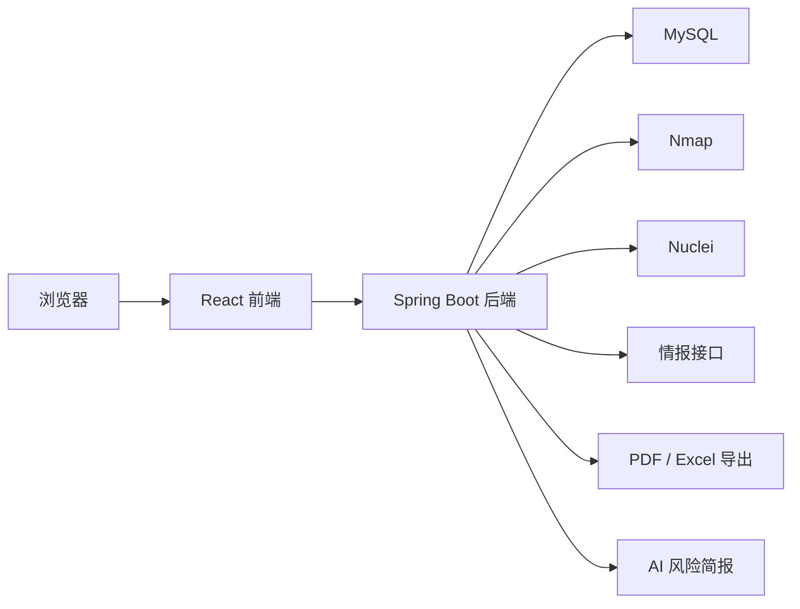
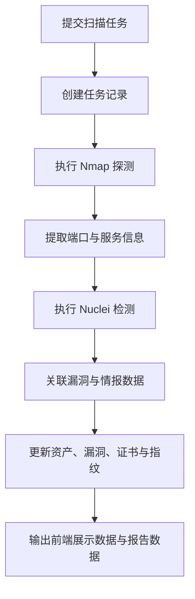
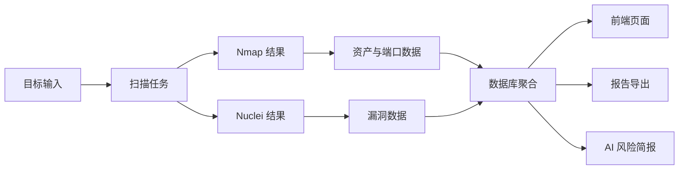

# 技术架构

## 总体架构

ServerScout 采用前后端分离架构。前端负责资产、漏洞、拓扑和报告等页面展示，后端负责认证授权、任务编排、扫描执行、数据聚合与导出能力，MySQL 负责持久化，Nmap 与 Nuclei 负责底层扫描。

## 前端架构

- 技术栈：React 18、TypeScript、Vite、Tailwind CSS、Ant Design
- 路由页面：
  - 仪表盘 `DashboardPage`
  - 资产列表 / 详情 `AssetListPage`、`AssetDetailPage`
  - 扫描任务列表 / 详情 `ScanTaskListPage`、`ScanTaskDetailPage`
  - 漏洞列表 / 详情 `VulnerabilityListPage`、`VulnerabilityDetailPage`
  - 攻击面、拓扑、报告、设置、情报、AI 简报、手册
- 主要职责：
  - 调用后端接口
  - 展示风险数据与图表
  - 承载任务交互和筛选
  - 显示统一的认证与错误处理结果

## 后端架构

- 技术栈：Spring Boot 3、Spring Security、JPA / Hibernate、JWT
- 控制层模块：
  - 认证与用户：`AuthController`、`UserController`
  - 资产与漏洞：`AssetController`、`VulnerabilityController`
  - 扫描与进度：`ScanTaskController`、`PluginController`
  - 情报与扩展：`ExternalIntelController`、`CrawlerController`、`SubdomainController`
  - 报告与辅助：`ReportController`、`AiBriefingController`、`OperationLogController`
- 服务层模块：
  - 扫描执行与并发控制
  - CVE 关联、证书收集、Web 指纹、蜜罐识别
  - 风险简报、报表导出、系统配置、日志记录

## 数据库设计概览

核心实体包括：

- `Asset`：资产基础信息
- `Port`：端口与服务探测结果
- `AssetVulnerability`：资产与漏洞关联
- `CveDatabase`：CVE 元数据
- `ScanTask`：扫描任务
- `ScanAssetMapping`：任务与资产映射
- `SslCertificate`：证书信息
- `WebFingerprint`：Web 指纹
- `HoneypotDetection`：蜜罐识别结果
- `OperationLog`：操作日志

## 扫描任务流程

## 数据流转

## Nmap 集成说明

- 用于端口探测、服务识别、基础网络信息采集
- 后端通过 `app.scan.nmap-path` 配置调用路径
- 结果进入资产、端口与服务模型，供后续漏洞和拓扑分析使用

## Nuclei 集成说明

- 用于模板化漏洞检测
- 后端通过 `app.scan.nuclei-path` 配置调用路径
- 检测结果与资产和 CVE 信息关联，进入漏洞展示与报告流程

## 报告导出流程

- 根据扫描任务收集关联资产、端口、漏洞、证书与指纹数据
- 生成 PDF 或 Excel 输出
- 提供下载接口，便于提交验收与汇报展示

## AI 风险简报流程

- 接收扫描结果或证据文本
- 提取资产与风险信号
- 生成结构化风险摘要、优先级与建议
- 在未配置模型接口时使用本地分析兜底

## 安全设计

- 基于 Spring Security + JWT 的认证授权机制
- 控制敏感操作访问范围
- 操作日志用于审计关键动作
- 对异常和错误响应采用统一结构，避免直接泄露底层细节

## 异常处理设计

- 业务异常由自定义异常体系统一表达
- `GlobalExceptionHandler` 负责返回统一响应结构
- 认证失败与权限不足由安全层专门处理
- 对扫描或第三方服务异常进行分级封装，避免向前端暴露敏感底层信息

## 可扩展方向

- 扫描插件化与任务模板能力增强
- 分布式任务调度与更细粒度限流
- 更完整的威胁情报接入
- 更丰富的报表模板与导出格式
