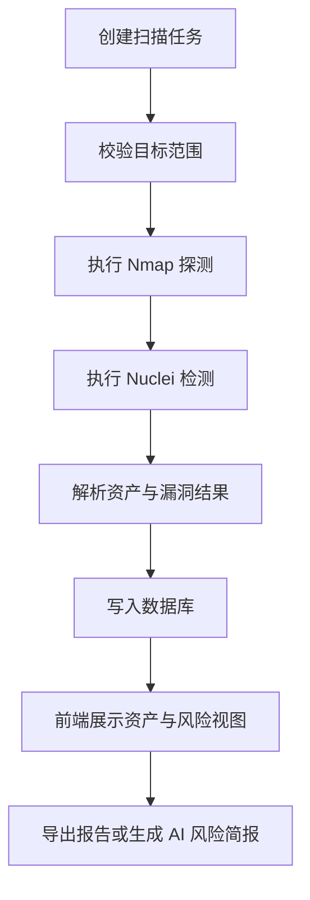

# 项目介绍

## 项目背景

在服务器资产治理与安全巡检场景中，扫描结果通常分散在端口探测、漏洞检测、情报查询和人工记录之间，缺少统一的资产视图与风险归档方式。ServerScout 的目标是把这些分散结果整合为可跟踪、可分析、可展示的统一平台。

## 解决的问题

- 资产信息分散，难以形成统一台账
- 扫描结果与漏洞信息缺少关联展示
- 端口、服务、漏洞、证书和情报数据难以放在同一视图中分析
- 安全报告整理成本高，人工汇总重复度高
- 技术扫描结果不易转化为更易阅读的风险说明

## 项目目标

- 建立统一的服务器资产与风险管理平台
- 打通资产发现、扫描执行、数据归档、风险展示和报告输出流程
- 为毕业设计与工程展示提供完整的全栈项目案例

## 使用场景

- 授权资产的安全巡检与基础风险梳理
- 安全分析课程或毕业设计展示
- Java 后端与 React 前端整合项目展示
- Nmap / Nuclei 扫描工具集成实践

## 核心流程

## 功能模块

- 用户认证与权限控制
- 仪表盘总览
- 资产管理与资产详情
- 扫描任务管理与进度追踪
- 漏洞列表与漏洞详情
- 外部情报查询
- 攻击面拓扑与可视化
- 报告导出
- AI 风险简报
- 系统设置与操作日志

## 项目价值

- 将安全扫描结果从原始输出转化为可持续维护的资产与风险数据
- 兼顾工程实现、业务流程和文档展示，适合作为正式项目案例
- 便于演示扫描工具接入、全栈协作和可视化分析能力

## 项目边界

- 本项目面向授权资产安全分析，不提供未授权攻击能力
- AI 风险简报用于辅助说明，不替代人工安全判断
- 项目不宣称企业级生产落地、真实客户案例或线上规模数据

## 作者

作者：18307519324az  
GitHub：https://github.com/18307519324az
